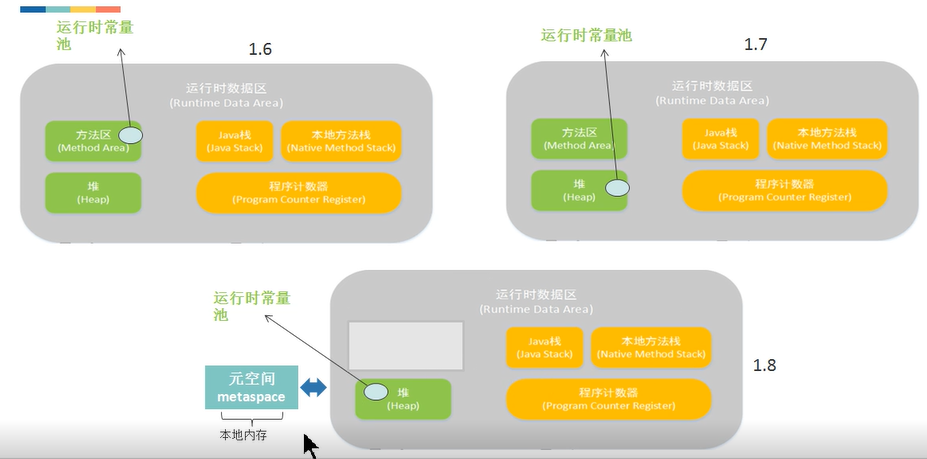

### JVM的内存布局

程序计数器: 记录程序的下一跳，像代码行号的指示器

JAVA虚拟机栈: 每个方法在被调用的时候就会创建一个栈帧，每个方法从调用到执行的过程，就对应着一个栈帧入栈到出栈的过程。

JAVA虚拟机堆: 是Java虚拟机所管理的内存中最大的一块。被所有线程共享的内存区域，对象实例在这里分配内存。是垃圾收集器(GC)管理的主要区域。

方法区: 存储被虚拟机加载的类信息、常量、静态变量、即时编译器编译后的代码等数据，运行时常量池(RunTime Constant Pool)是方法区的一部分。

直接内存: 直接内存(Direct Memory) 并不是虚拟机运行时数据区的一部分，也不是Java虚拟机规范中定义的内存区域。

1.6 运行时常量池在方法区，1.7后在堆中，1.8移除了方法区，多了元空间 

### 垃圾回收机制

#### 标记-清楚算法

(Mark-Sweep)  
内存碎片，内存不规整

#### 复制算法

空间浪费，总有一半以上的空间没被使用

#### 标记-整理算法

(Mark-Compact)  
内存区域块的移动，性能有所影响

#### 把算法都用上

分代收集，分新生代、年老代  
并行式垃圾回收  

传统的GC收集器将连续的内存空间划分为新生代，老年代和永久代（JDK 8移除了永久代，约会了元空间Metaspace），这种划分的特点是各代的存储地址（逻辑地址，下同）是连续的。如下图所示：传统GC内存布局

而G1的各代存储地址是不连续的，每一代都使用了n个不连续的大小相同的区域，每个区域占有一块连续的虚拟内存地址。如下图所示：

新生代 复制算法， 老年代 用了标记清除算法
**G1** 不再是划分为两大块，划分得更加详细，提出了很多性能上的提升。

参考文章: [美团技术团队](https://tech.meituan.com/2016/09/23/g1.html)

#### G1 GC模式

G1提供了两种GC模式，Young GC和混合GC，两个都是完全停止世界的。* Young GC：允许所有年轻代里的区域。通过控制年轻代的区域个数，即年轻代内存*混合GC：将所有年轻代里的区域，外加根据全局并发标记统计转换收集收益高的多个老年代区域。在用户指定的目标范围内进行调整选择收益高的老年代地区。

由上面的描述可知，混合GC不是完整GC，它只能回收部分老年代的区域，如果混合GC实在无法跟上程序分配内存的速度，导致老年代填满无法继续进行混合GC，就会使用串行所以我们可以知道，G1是不提供完整GC的。

上文中，多次提到了全局并发标记，它的执行过程类似CMS，但是不同的是，在G1 GC中，它主要是为混合GC提供标记服务的，而不是一次GC过程的一个必须重叠。 *并发标记（Concurrent Marking）。这个阶段从GC Root开始对堆。*并发标记（Concurrent Marking）。这个阶段从GC Root开始对堆。 *最终标记（Remark，STW）。标记那些在并发标记阶段发生变化的对象，将被回收。*清除垃圾（Cleanup）。清除空区域（没有存活对象的），加入免费列表。

第一阶段初始标记是共享了Young GC的暂停，这是因为他们可以替换root scan操作，所以可以说global并发标记是伴随Young GC而发生的。第四阶段清理只是回收了没有存活对象的Region ，所以它并不需要STW。

*是G1HeapWastePercent：在全局并发标记结束之后，，实际上是由一些参数控制着的，另外也控制着其中老年代Region会被选入CSet。 * G1MixedGCLiveThresholdPercent，我们可以知道旧时代地区中有多少空间要被回收，在每次YGC之后和再次发生混合GC之前，会检查垃圾占比是否达到此参数，只有达到了，下次才会发生混合GC。 ：旧世代区域中的存活对象的占比，只有在此后的参数之下，才会被选入CSet。* G1MixedGCCountTarget：一次全局并发标记之后，最大执行混合GC的次数。* G1OldCSetRegionThresholdPercent：一次混合GC中能被选入CSet的最多的上一代地区数量。

除了以上的参数，G1 GC相关的其他主要的参数有：

|参数|意味着|
|:----:|:----:|:----:|
|-XX：G1HeapRegionSize = n | 设置Region大小，并非最终值|
|-XX：MaxGCPauseMillis| 	设置G1收集过程目标时间，设置值200ms，不是硬性条件|
|-XX：G1NewSizePercent|新生代系数，预设值5％|
|-XX：G1MaxNewSizePercent|新生代变量，预设值60％|
|-XX：ParallelGCThreads|STW期间，并行GC线程数|
|-XX：ConcGCThreads = n|	并发标记阶段，并行执行的线程数|
|-XX：正在启动堆占用率|	设置触发标记周期的Java堆占用率阈值。默认值是45％。这里的java堆占比指的是non_young_capacity_bytes，包括old + humongous|

### 杂

多线程下 i-- 不是一个原子性操作

CPU 线程 1:1 关系，时间片轮转机制

AtomicInteger 底层原理  CAS (compare and swap)

ABA 问题

Sync 解决  synchronized(非公平), Lock （ReentrantLock 可重入锁）

### 引用

#### 强引用

- 最普通的引用: Object obj = new Object()
- 抛出OutOfMemoryError 终止程序也不会回收具有强引用的对象
- 通过将对象设置为null来弱化引用，使其被回收

#### 软引用

- 对象处在有用但非必须的状态
- 只有当内存空间不足时，GC会回收该引用的对象的内存
- 可以用来实现高速缓存

#### 弱引用

- 非必须的对象，比软引用更弱
- GC时会被回收
- 被回收的概率不大，因为GC线程优先级比较低
- 适用于引用偶尔被使用且不影响垃圾收集的对象

#### 虚引用

- 不会决定对象的生命周期
- 任何时候都可能被垃圾收集器回收
- 跟踪对象被垃圾收集器回收的活动，起哨兵作用
- 必须和引用队列ReferenceQueue联合使用

#### 区别

| 引用类型 | 被垃圾回收时间 |      用途      |      生存时间     |
|:--------:|:--------------:|:--------------:|:-----------------:|
|  被强用  |    从来不会    | 对象的一般状态 | JVM停止运行时终止 |
|  被软用  |  在内存不足时  |    对象缓存    |   内存不足时终止  |
|  弱引用  |  在垃圾回收时  |    对象缓存    |    gc运行后终止   |
|  虚引用  |     Unknown    |   标记、哨兵   |      Unknown      |